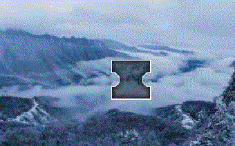
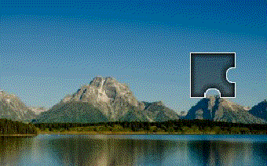
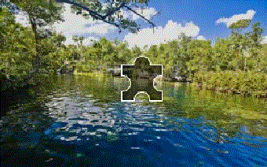
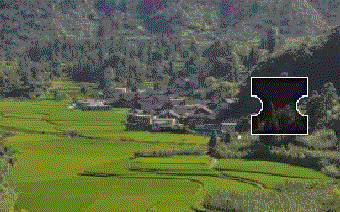
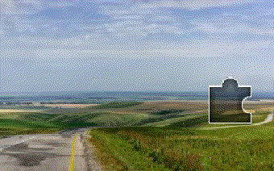

# geetest-slider-captcha-bypass
 


Bypass Geetest Slider Captcha using _**Selenium and OpenCV**_

<hr>
To install required dependencies, run this in a shell/terminal

```
pip install -r requirements.txt
apt install chromium-chromedriver # if running of linux
```
Now import the `GSC_solver` class
```
from gsc import GSC_solver

gcs = GSC_solver()
search_term = 'bts_official_bighit'
driver = gcs.solve(f'https://www.tiktok.com/@{search_term}')
```
or
```
. . .

driver = webdriver.Chrome(chrome_driver_path, desired_capabilities=caps, options=chrome_options)
search_term = 'bts_official_bighit'
driver.get(f'https://www.tiktok.com/@{search_term}')

# Solve captcha by passing webdriver object
driver = gcs.solve(driver)

. . .
```
<hr>
<p>


<p>
<p>


<p>
<p>


<p>
<hr>
<p>



<p>
<p>



<p>
<p>



<p>
<hr>
If you want to save snapshots like these, give location at `snapshot_path` in `solve`
```
gcs.solve(. . . , snapshot_path = 'enter_path_here')
```
